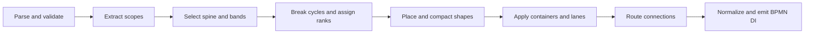
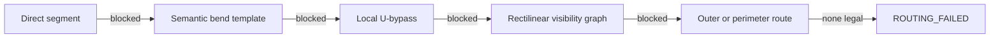
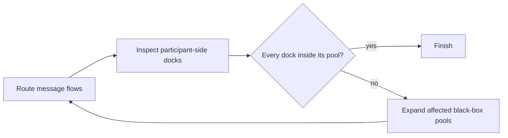

# BPMN layout engine

This document describes the layout produced by `bpmn-auto-layout` and the
algorithm that produces it. The implementation is
[`Layouter`](../lib/Layouter.js); executable behavior lives
in [`LayoutSpec.js`](../test/LayoutSpec.js) and the reviewed
[fixture corpus](../test/fixtures).

## Contract

Generated process flow reads from left to right. The engine prioritizes:

1. valid geometry: containment and docking are correct, unrelated shapes do not
   overlap, and edges do not pass through unrelated shapes;
2. narrative: the primary path is continuous, branches are distinguishable,
   and exception paths remain separate from normal flow;
3. polish: fewer crossings, bends, long edges, and unused space.

Layout is greenfield. Existing coordinates, dimensions, waypoints, and labels
are discarded. Existing DI only determines whether an embedded sub-process is
expanded.

Equal alternatives are resolved by BPMN declaration order. The same semantic
input therefore produces byte-identical output.

## Model

BPMN is directed, nested, and lane-constrained. The engine uses a constrained
layered layout:

- **ranks** establish left-to-right progress;
- **semantic bands** establish vertical narrative roles;
- **containers** recursively constrain child layouts;
- **orthogonal routing** connects final shape positions.

This is a BPMN-specific layered algorithm, not a generic graph layout followed
by BPMN patches.

The layout state for each process or sub-process contains shape bounds, edge
waypoints, child layouts, and the BPMN plane on which each child is emitted.

## Input and validation

[`layoutProcess`](../lib/index.js) parses XML with `bpmn-moddle`, selects a
collaboration when one exists or otherwise the first process, removes existing
diagrams, generates new geometry, and serializes the result.

The engine rejects input for which valid geometry would be misleading or
undefined. [`LayoutError`](../lib/LayoutError.js) provides stable codes for:

- invalid or cross-scope sequence flows;
- invalid message-flow endpoints;
- invalid boundary-event hosts;
- incompatible lane membership;
- invalid link-event pairs;
- unsupported visual elements;
- collaborations without a laid-out process;
- routes that cannot avoid unrelated shapes.

An empty definitions document remains valid and receives no invented process.

## Recursive scope layout

Each process and sub-process is laid out independently. `layoutScope` separates:

- ordinary flow nodes and sequence flows;
- boundary events and their handlers;
- event sub-processes;
- artifacts and associations.

Every visual node receives its BPMN element, declaration index, default size,
role, expansion state, and eventual bounds. Sub-process contents are laid out
before their parent.

Expanded sub-processes contain their child geometry on the parent plane.
Collapsed sub-processes remain one parent-level activity and receive a separate
plane for their child process.

## Semantic policy

### Components and starts

Weakly connected components include ordinary sequence flows and boundary
handlers. A component starts at:

1. its earliest declared start event;
2. otherwise its earliest node without an incoming sequence flow;
3. otherwise its earliest declared node.

Normal disconnected components are laid out independently and stacked
vertically in declaration order. Adding a later component does not move an
earlier one.

### Primary path

The primary path, or spine, is selected one edge at a time:

1. prefer an edge whose target can reach an end event;
2. among eligible edges, prefer the BPMN default flow;
3. otherwise use declaration order.

This prevents a dead-end alternative from becoming the main narrative merely
because it was declared first. The selected edge and deterministic
single-outgoing continuations are marked straight and routed before alternatives.

When unobstructed, a spine edge is one horizontal segment from the source's
right center to the target's left center.

### Semantic bands

Band `0` is the spine. Other bands encode branch meaning:

- alternatives without a default alternate below, above, farther below, and
  farther above;
- alternatives to a default flow fan to one side;
- alternatives from an off-spine gateway fan farther away from the spine;
- error handlers occupy lower bands;
- escalation handlers occupy upper bands;
- paired link events align on one band.

A band reservation includes the ranks over which its path exists. Disjoint
paths may reuse a physical band; overlapping narratives may not.

Boundary events stay attached to their host. Events of the same kind are
distributed along the relevant host edge in declaration order. Handler flows
leave through the outside-facing side and never enter the host interior.
Named events attached to the top edge receive an explicit external label above
the event and beside the handler exit, opposite its first horizontal direction.

## Cycles, ranks, and coordinates

`markBackEdges` performs a deterministic depth-first traversal from semantic
starts. The cycle graph includes ordinary sequence flows and an implicit edge
from each boundary-event host into its handler path. Edges that close a cycle
are temporarily excluded from rank assignment and later routed as feedback
edges.

`assignRanks` computes longest-path ranks over the remaining DAG. Boundary
handlers participate in a bounded fixed-point pass so their targets cannot
precede their hosts.

A nested gateway join that feeds an enclosing join of the same gateway type
from another semantic band has zero rank distance. The two joins therefore
share a column and connect vertically instead of introducing an empty
horizontal step. Different gateway types retain a forward step.

Each rank becomes an x-position. Its width is the widest node in that rank.
Each semantic band becomes a y-position. Nodes sharing a rank and band are
separated in declaration order.

Initial placement is refined in this order:

1. clear boundary-handler exits;
2. reuse non-overlapping band intervals;
3. separate same-rank shape overlaps;
4. pack disconnected components;
5. apply lane membership;
6. dock boundary events.

Geometry uses these base constants:

| Constraint | Value |
| --- | ---: |
| Horizontal gap | 100 px |
| Vertical gap | 80 px |
| Plane margin | 80 px |
| Expanded sub-process padding | 40 px |
| Routing margin | 20 px |
| Participant header width | 30 px |
| Lane content padding | 40 px |

Layout may add space for containers and routing; it does not reduce these gaps.
Bounds and waypoints are normalized to integers before DI emission.

## Ad-hoc sub-processes

Ad-hoc semantics do not impose an execution order on disconnected children.
Using the normal vertical component stack would therefore create long, sparse
containers.

The ad-hoc policy compacts without reading labels or authored coordinates:

- for a split whose branches reconverge, normal primary-path semantics choose
  the horizontal continuation while alternate paths use reduced rank weights
  and vertical space;
- disconnected components are packed in two dimensions toward a square
  footprint;
- component footprints include routing gaps, so packing does not create a shape
  arrangement the router cannot use.

Connected components still preserve their sequence-flow order.

## Containers, lanes, and artifacts

### Sub-processes

An expanded embedded sub-process is sized around its child layout with 40 px
padding and a minimum size of 140 x 120 px. Parent sequence flows dock at its
perimeter; child flows remain inside.

A collapsed sub-process uses normal activity dimensions in its parent. Its child
plane is normalized independently and has no coordinate relationship to the
collapsed parent shape.

Event sub-processes are placed after normal flow so they do not claim a normal
rank or band.

### Lanes

Lanes are horizontal and may be nested. A node occupies its unique deepest
lane. Redundant membership in an ancestor lane is valid; membership in
incomparable lanes is not.

Nodes retain their semantic rows inside lanes, and lane bounds expand to contain
them. A sequence flow may cross the borders of its source and target lanes, but
not an unrelated lane.

### Artifacts

Text annotations, data object references, and data store references are a
post-routing decoration pass. They do not affect ranks, bands, process-shape
placement, or sequence-flow routing.

Text annotation dimensions are derived from deterministic word wrapping across
several candidate widths. Placement evaluates positions above, below, left, and
right of the associated owner, sliding along each side when needed. Candidates
must stay clear of process shapes and previously placed artifacts. The score
then minimizes process-edge intersections, association crossings and length,
unreadable annotation aspect ratios, diagram expansion, and displacement from
the preferred side. Boundary events reserve additional space for their outward
handler channels. Long and multiply-associated artifacts are placed first.
Text annotations and data store references may be placed fully outside their
owner lane when that produces cleaner association geometry. Containment remains
a soft preference, and candidates may not straddle a lane border or overlap a
participant header. Participant bounds are derived from process containers and
flow shapes rather than exterior decorations, while participant spacing still
accounts for the decorations' complete footprint. Data object references remain
fully contained in their owner's lane.

Data object and data store references retain their standard dimensions but use
the same obstacle-aware search. Resolvable associations are routed after both
bounds are known. Connections still treat artifacts as transparent, and
artifact intersections remain excluded from hard geometry defects.

Groups remain semantic-only because BPMN does not identify their visual members.
The engine does not infer group bounds from authored DI.

## Sequence-flow routing

Routing starts only after shape coordinates are final. Straight spine edges are
routed first, followed by cross-band gateway branches, other detours, and
feedback edges. Cross-band gateway branches claim their constrained top or
bottom channels before same-band detours choose an outer depth. Later edges
treat accepted routes as allocated geometry.

Ports follow semantics:

- same-band forward flows leave right and enter left;
- cross-band gateway branches leave through the top or bottom;
- joins may enter vertically;
- boundary handlers leave through the outside-facing side;
- self-loops route locally around their source;
- feedback and shape-spanning forward edges use nested outer channels;
- U-routed edges try the opposite local side, with matching endpoint ports,
  before escalating when their preferred side is blocked. Nested routes retain
  the bottom-side channel order. For an isolated gateway default flow, both
  local sides are compared at the same constraint level; the shorter route wins
  and equal routes use the top channel as the deterministic tie-break.

Boundary events attached to the same host side are ordered by their handlers'
outward destination distance, longest first. This creates nested vertical exits
without weaving; declaration order breaks equal-distance ties.

The router escalates from the simplest candidate to the most general:

The rectilinear visibility graph uses x- and y-coordinates derived from endpoint
ports, shape margins, and outer bounds. Dijkstra-style shortest-path search
chooses a legal orthogonal path.

A segment is legal when it:

- does not enter an unrelated shape;
- does not properly cross an allocated edge;
- does not create a forbidden positive-length overlap.

Shared endpoints, endpoint touches, and intentional shared endpoint channels are
not proper crossings.

## Collaborations and message flows

Every participant with a process reference contains an independently laid-out
process. Its pool is sized around that process. Black-box participants remain
empty and are sized and positioned from message-flow anchors.

When black-box participants communicate directly, participant order first
minimizes unrelated pools between connected pairs. It then minimizes a
deterministic score combining vertical message-flow travel and bend cost:

- up to eight participants use exhaustive permutation search;
- larger collaborations use deterministic greedy insertion.

Message flows are generated when both endpoints resolve to visible layout
geometry. An endpoint inside a collapsed sub-process resolves to its nearest
visible collapsed ancestor. Opposing directions receive stable channel offsets.
Adjacent pools use their shared gutter; non-adjacent pools may use an outside
channel. Routes avoid process-node obstacles, and obstacle-avoiding route legs
consider previously allocated message flows.

Black-box pool sizing and message routing form a fixed point:

This prevents a valid obstacle-avoiding route from leaving its participant-side
dock outside the final pool bounds.

## DI emission

The complete layout is translated so its minimum extents begin at the 80 px
outer margin. [`DiFactory`](../lib/di/DiFactory.js) emits BPMN shapes and edges.

Expanded child layouts are emitted on their parent plane. Collapsed sub-process
children are normalized and emitted recursively on separate planes.

Before serialization, endpoint geometry is normalized across the complete DI
plane. A docked segment must have an outward component normal to its shape side;
tangent segments are redirected to the matching side, and redundant waypoints
inside endpoint bounds are removed. If redirecting would collapse the endpoint
segment, a short outside dogleg preserves an explicit outward approach.
Boundary handlers always leave from the attached event's top or bottom center
through a short vertical outward stub. Obstacle avoidance may turn only after
that stub and approaches the target through its facing side center.
Clear orthogonal sequence-flow elbows are rebuilt from side centers. If the
direct centered L-route is obstructed, a short outside channel approaches the
target through the facing side instead of moving either endpoint to a corner.
Candidates without proper edge crossings are preferred, but an unavoidable
edge crossing does not permit corner docking; shape-clear side-center docking
remains a hard constraint.

Top-attached named boundary events receive independent label DI; other labels
use renderer defaults. Unknown visual elements do not receive task-sized
fallback geometry.

## Implementation map

| Concern | Main implementation |
| --- | --- |
| Root and recursive scope orchestration | [`Layouter`](../lib/Layouter.js) |
| Collaboration and message-flow layout | [`CollaborationLayouter`](../lib/layout/CollaborationLayouter.js) |
| Spine, components, bands, cycles, and ranks | [`SemanticPolicy`](../lib/layout/SemanticPolicy.js) |
| Coordinates, compaction, lanes, and boundary events | [`ShapePlacement`](../lib/layout/ShapePlacement.js) |
| Sequence-flow routing | [`SequenceFlowRouter`](../lib/layout/SequenceFlowRouter.js) |
| Artifact placement and association routing | [`ArtifactLayouter`](../lib/layout/ArtifactLayouter.js) |
| Layout state and geometry | [`LayoutUtil`](../lib/layout/LayoutUtil.js) |
| Input validation | [`Validation`](../lib/layout/Validation.js) |
| DI output and final docking | [`LayoutEmitter`](../lib/di/LayoutEmitter.js), [`DiFactory`](../lib/di/DiFactory.js) |

## Maintaining the contract

For an intentional behavior change:

1. add or update a focused assertion in
   [`LayoutSpec.js`](../test/LayoutSpec.js) or a minimal
   [fixture](../test/fixtures);
2. inspect the generated output and committed snapshot as described in
   [`test/README.md`](../test/README.md);
3. review the corpus metrics;
4. update this document when the rule or mechanism changed.

Snapshots record exact geometry. Metrics report crossings, shape overlaps,
edge/shape intersections, wrong-way endpoint dockings, and total edge length.
Wrong-way docking must remain zero across the fixture corpus. Neither snapshots
nor metrics replace visual review.
