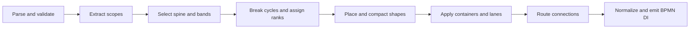
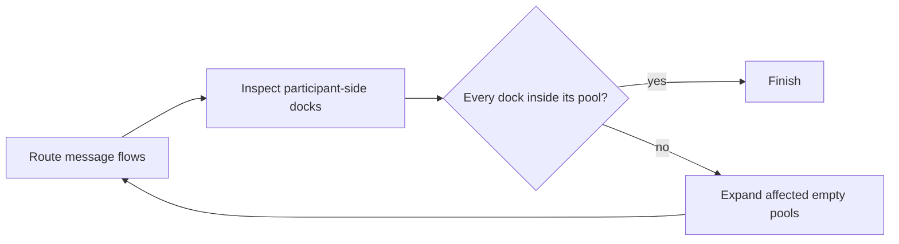

# How layout works

This document describes the layout produced by `bpmn-auto-layout` and the
algorithm that produces it. The implementation is
[`Layouter`](../lib/Layouter.js); executable behavior lives
in [`LayoutSpec.js`](../test/LayoutSpec.js) and the reviewed
[fixture corpus](../test/fixtures).

For a concrete trace through every pipeline stage, see the
[boundary-error-event walkthrough](./WALKTHROUGH.md).

## Contract

Generated process flow reads from left to right. The engine prioritizes:

1. valid geometry: containment and docking are correct, unrelated shapes do not
   overlap, and edges do not pass through unrelated shapes;
2. narrative: the primary path is continuous, branches are distinguishable,
   and exception paths remain separate from normal flow;
3. polish: fewer crossings, bends, long edges, and unused space.

Layout is greenfield. Existing coordinates, dimensions, waypoints, and labels
are discarded. Existing DI only determines whether an embedded sub-process is
expanded.

Equal alternatives are resolved by BPMN declaration order. The same semantic
input therefore produces byte-identical output.

## Model

BPMN is directed, nested, and lane-constrained. The engine uses a constrained
layered layout:

- **ranks** establish left-to-right progress;
- **semantic bands** establish vertical narrative roles;
- **containers** recursively constrain child layouts;
- **orthogonal routing** connects final shape positions.

This is a BPMN-specific layered algorithm, not a generic graph layout followed
by BPMN patches.

The layout state for each process or sub-process contains shape bounds, edge
waypoints, child layouts, and the BPMN plane on which each child is emitted.

## Input and validation

[`layoutProcess`](../lib/index.js) parses XML with `bpmn-moddle`, selects a
collaboration when one exists or otherwise the first process, removes existing
diagrams, generates new geometry, and resolves with `{ xml, warnings }`.

The engine rejects input for which valid geometry would be misleading or
undefined. [`LayoutError`](../lib/LayoutError.js) provides stable codes for:

- invalid or cross-scope sequence flows;
- invalid message-flow endpoints;
- invalid boundary-event hosts;
- incompatible lane membership;
- invalid link-event pairs;
- unsupported visual elements;
- collaborations without a laid-out process;
- routes that cannot avoid unrelated shapes.

Non-fatal omissions are reported as
[`LayoutWarning`](../lib/LayoutWarning.js) instances. After DI emission, the
engine checks every supported visual shape and connection across all generated
planes. `DI_NOT_CREATED` reports a semantic element for which no corresponding
shape or edge was emitted. A group whose category value has no visible
explicitly referenced members is omitted with `GROUP_MEMBERS_NOT_FOUND`.

An empty definitions document remains valid and receives no invented process.

## Recursive scope layout

Each process and sub-process is laid out independently. `layoutScope` separates:

- ordinary flow nodes and sequence flows;
- boundary events and their handlers;
- event sub-processes;
- artifacts and associations.

Every visual node receives its BPMN element, declaration index, default size,
role, expansion state, and eventual bounds. Sub-process contents are laid out
before their parent.

Expanded sub-processes contain their child geometry on the parent plane.
Collapsed sub-processes remain one parent-level activity and receive a separate
plane for their child process.

## Semantic policy

### Components and starts

Weakly connected components include ordinary sequence flows and boundary
handlers. A component starts at:

1. its earliest declared start event;
2. otherwise its earliest node without an incoming sequence flow;
3. otherwise its earliest declared node.

Normal disconnected components are laid out independently and stacked
vertically in declaration order. Adding a later component does not move an
earlier one.

### Primary path

The primary path, or spine, is selected one edge at a time:

1. prefer an edge whose target can reach an end event;
2. among eligible edges, prefer the BPMN default flow;
3. otherwise use declaration order.

This prevents a dead-end alternative from becoming the main narrative merely
because it was declared first. The selected edge and deterministic
single-outgoing continuations are marked straight and routed before alternatives.

When unobstructed, a spine edge is one horizontal segment from the source's
right center to the target's left center.

### Semantic bands

Band `0` is the spine. Other bands encode branch meaning:

- alternatives without a default alternate below, above, farther below, and
  farther above;
- alternatives to a default flow fan to one side;
- alternatives from an off-spine gateway fan farther away from the spine;
- error handlers occupy lower bands;
- escalation handlers occupy upper bands;
- paired link events align the catch continuation with the throw until that
  continuation rejoins other flow.

A band reservation includes the ranks over which its path exists. Disjoint
paths may reuse a physical band; overlapping narratives may not.

Boundary events stay attached to their host. Events of the same kind are
distributed along the relevant host edge in declaration order. Handler flows
leave through the outside-facing side and never enter the host interior.
Named events attached to the top edge receive an explicit external label above
the event and beside the handler exit, opposite its first horizontal direction.

## Cycles, ranks, and coordinates

`markBackEdges` performs a deterministic depth-first traversal from semantic
starts. The cycle graph includes ordinary sequence flows and an implicit edge
from each boundary-event host into its handler path. Edges that close a cycle
are temporarily excluded from rank assignment and later routed as feedback
edges.

`assignRanks` computes longest-path ranks over the remaining DAG. Boundary
handlers participate in a bounded fixed-point pass so their targets cannot
precede their hosts.

A nested gateway join that feeds an enclosing join of the same gateway type
from another semantic band has zero rank distance. The two joins therefore
share a column and connect vertically instead of introducing an empty
horizontal step. Different gateway types retain a forward step.

Each rank becomes an x-position. Its width is the widest node in that rank.
Each semantic band becomes a y-position. Nodes sharing a rank and band are
separated in declaration order.

Initial placement is refined in this order:

1. clear boundary-handler exits;
2. reuse non-overlapping band intervals;
3. separate same-rank shape overlaps;
4. pack disconnected components;
5. apply lane membership;
6. dock boundary events.

Geometry uses these base constants:

| Constraint | Value |
| --- | ---: |
| Horizontal gap | 100 px |
| Vertical gap | 80 px |
| Plane margin | 80 px |
| Expanded sub-process padding | 40 px |
| Named expanded sub-process title band | 28 px |
| Group padding | 40 px |
| Routing margin | 20 px |
| Participant header width | 30 px |
| Lane content padding | 40 px |

Layout may add space for containers and routing; it does not reduce these gaps.
Bounds and waypoints are normalized to integers before DI emission.

## Ad-hoc sub-processes

Ad-hoc semantics do not impose an execution order on disconnected children.
Using the normal vertical component stack would therefore create long, sparse
containers.

The ad-hoc policy compacts without reading labels or authored coordinates:

- for a split whose branches reconverge, normal primary-path semantics choose
  the horizontal continuation while alternate paths use reduced rank weights
  and vertical space;
- disconnected components are packed in two dimensions toward a square
  footprint;
- component footprints include routing gaps, so packing does not create a shape
  arrangement the router cannot use.

Connected components still preserve their sequence-flow order.

## Containers, lanes, and artifacts

### Sub-processes

An expanded embedded sub-process is sized around its child layout with 40 px
padding and a minimum size of 140 x 120 px. A named sub-process reserves a
centered, fixed-height 28 px title area inside its top padding; multiline titles
do not enlarge this area. If an external label has no close preferred position
other than that title area, the complete child layout moves down by 28 px so the
label can remain adjacent to its owner. Parent sequence flows dock at the
sub-process perimeter; child flows remain inside.

A collapsed sub-process uses normal activity dimensions in its parent. Its child
plane is normalized independently and has no coordinate relationship to the
collapsed parent shape.

Event sub-processes are placed after normal flow so they do not claim a normal
rank or band.

### Lanes

Lanes are horizontal and may be nested. A node occupies its unique deepest
lane. Redundant membership in an ancestor lane is valid; membership in
incomparable lanes is not.

Nodes retain their semantic rows inside lanes, and lane bounds expand to contain
them. Sequence flows may cross any number of sibling lanes. Lane regions are
traversable; flow-node shapes in intervening lanes remain routing obstacles.

### Artifacts

Text annotations, data object references, and data store references are a
post-routing decoration pass for process, sub-process, and collaboration
scopes. They do not affect ranks, bands, process-shape placement, or
sequence-flow routing.

Text annotation dimensions are derived from deterministic word wrapping across
several candidate widths. Placement evaluates positions above, below, left, and
right of the associated owner, sliding along each side when needed. Every
artifact candidate must stay clear of process shapes, sequence flows, message
flows, and previously placed artifacts. Among valid positions, routed
association length is the
primary cost, with a bounded penalty for non-straight associations so a
near-shortest single horizontal or vertical segment is preferred over a
diagonal or bent route. Readable annotation aspect ratio, association crossings,
diagram expansion, and displacement from the preferred side break later ties.
Boundary events reserve additional space for their outward handler channels.
Long and multiply-associated artifacts are placed first. Text annotations may
be placed in the outermost diagram scope regardless of their semantic owner.
They must be wholly inside or wholly outside every subprocess, lane, and
participant, never crossing a container edge. Participant header strips are
also reserved. In a single-participant collaboration, collaboration-owned
annotations prefer positions above or below their owner participant, with a
centered vertical association. For process-owned annotations in a collaboration,
the future participant boundary is derived before exterior artifacts are
placed, using the same content extents and padding as final participant sizing.
Participant bounds are derived from process containers and flow shapes rather
than exterior decorations, while participant spacing still accounts for the
decorations' complete footprint. Data object references remain fully contained
in their owner's lane. All artifacts emitted on the same BPMN plane share one
collision domain regardless of semantic ownership or declaration scope.

Data object and data store references retain their standard dimensions but use
the same obstacle-aware search. Resolvable associations are routed after both
bounds are known, including associations from a parent- or collaboration-scope
artifact to a visible element inside an expanded subprocess or participant
process. Artifact placement admits only candidates whose direct association
segments clear flow-node shapes, so associations always have exactly two
waypoints and never introduce bendpoints. Process-internal connections treat
artifacts as transparent. Artifact placement reserves the vertical approach
corridors above and below every process node used as a message-flow endpoint.
This moves annotations out of the way before collaboration routing, preserving
straight message flows and visible associations. Exterior process annotations
prefer a participant's left or right side over positions above or below it, so
they do not expand collaboration rows and lengthen unrelated message flows.
Other artifact intersections remain excluded from hard geometry defects.

Groups are placed after artifacts and routing. Membership is explicit: a node
or connection belongs to a group when its `categoryValueRef` contains the
group's category value. Group bounds are the union of member shape bounds and
member connection waypoints, expanded by 40 px on every side. Groups are
transparent to routing and hard overlap metrics. Their category value is shown
as an external label above the group. Groups without visible explicit members
remain semantic-only and are omitted; authored group DI is not used to infer
membership.

## Sequence-flow routing

Routing starts only after shape coordinates are final. Straight spine edges are
routed first, followed by cross-band gateway branches, other detours, and
feedback edges. Cross-band gateway branches claim their constrained top or
bottom channels before same-band detours choose an outer depth. Later edges
treat accepted routes as allocated geometry.

Ports follow semantics:

- same-band forward flows leave right and enter left;
- cross-band gateway branches leave through the top or bottom;
- joins may enter vertically;
- boundary handlers leave through the outside-facing side;
- self-loops route locally around their source;
- feedback and shape-spanning forward edges use nested outer channels;
- U-routed edges try the opposite local side, with matching endpoint ports,
  before escalating when their preferred side is blocked. Nested routes retain
  the bottom-side channel order. For an isolated gateway default flow, both
  local sides are compared at the same constraint level; the shorter route wins
  and equal routes use the top channel as the deterministic tie-break.

Boundary events attached to the same host side are ordered by their handlers'
outward destination distance, longest first. This creates nested vertical exits
without weaving; declaration order breaks equal-distance ties.

The router escalates from the simplest candidate to the most general:

The rectilinear visibility graph uses x- and y-coordinates derived from endpoint
ports, shape margins, and outer bounds. Dijkstra-style shortest-path search
chooses a legal orthogonal path.

A segment is legal when it:

- does not enter an unrelated shape;
- does not properly cross an allocated edge;
- does not create a forbidden positive-length overlap.

Shared endpoints, endpoint touches, and intentional shared endpoint channels
are not proper crossings. Channels may be shared regardless of whether
connections enter or leave their common endpoint.

## Collaborations and message flows

Every participant with a process reference contains an independently laid-out
process. Its pool is sized around that process. Participants without process
content are positioned and minimally sized from message-flow anchors, whether
they have an empty process reference or no process reference. An empty
process-backed pool keeps its current alignment when every anchor already fits
with participant-header clearance.

For process participants without lanes, the 30 px participant header is added
before the normal 40 px process-content padding; it does not consume that
padding. Lane-backed participants start their lane tiles after the header, and
the lane layout supplies its own 40 px content padding.

After vertical ordering in a collaboration with multiple process-backed
participants, the largest process footprint remains the stable horizontal
anchor. Other expanded participants may move horizontally together with their
complete process layouts. Flow-node endpoints contribute their center as a
docking candidate. Participant endpoints contribute the usable interval along
their horizontal edge, inset by the routing margin, so candidate translations
can align a node with either end of that interval instead of forcing every
message flow through the participant center. No coordinate grid or authored DI
is consulted.

Deterministic coordinate descent compares the fully routed candidate geometry.
For collaborations above the exhaustive participant-ordering threshold it
minimizes bent message flows, proper edge crossings, the longest message-flow
route, total routed distance, and finally displacement from the initially
left-aligned layout, in that order. Smaller collaborations retain their
established crossing-first policy. Collaboration width is not
constrained because pool alignment is more important than the overall
footprint. Anchor-positioned participant geometry is recomputed from its
translated message anchors for every candidate. Single-process collaborations
retain their established process position and satellite geometry.

Once internal offsets are fixed, each disconnected message-flow component is
translated as a unit to the common left participant edge. This removes
arbitrary global X offsets between unrelated participant groups without
changing their internal message-flow geometry.

For a single process-backed participant, direct communication between
black-box participants first minimizes unrelated pools between connected
pairs. The established deterministic score then combines vertical message-flow
travel and bend cost. For multiple process-backed participants, every message
flow additionally contributes the vertical separation between non-adjacent
participant rows. This weighted separation places strongly interacting process
blocks around one another without changing the single-process satellite
policy:

- up to eight participants use exhaustive permutation search;
- larger collaborations use deterministic greedy insertion followed by
  remove-and-reinsert refinement.

After horizontal alignment, consecutive black-box participants may share a
vertical row when their horizontal bounds retain the normal horizontal gap.
Expanded participants always occupy an exclusive row with their complete
process footprint. Message-flow adjacency is computed by distinct participant
rows, so multiple black-box pools on one row do not create fictitious
intervening layers.

Message flows are generated when both endpoints resolve to visible layout
geometry. An endpoint inside a collapsed sub-process resolves to its nearest
visible collapsed ancestor. Opposing directions receive stable channel offsets.
Adjacent pools use their shared gutter; non-adjacent pools may use an outside
channel. Above the exhaustive participant-ordering threshold, endpoint-aligned
vertical corridors and the boundaries of intervening participants are evaluated
before either diagram exterior, and the shorter complete route is selected.
Smaller collaborations retain their established exterior-channel policy.
Routes avoid process-node obstacles, and obstacle-avoiding route legs consider
previously allocated message flows.

Empty pool sizing and message routing form a fixed point:

Participant docks are constrained to their pool bounds while routing. Empty
pools then expand around uncovered docks and reroute until straight flows stay
attached wherever obstacles permit.

## DI emission

The complete layout is translated so its minimum extents begin at the 80 px
outer margin. [`DiFactory`](../lib/di/DiFactory.js) emits BPMN shapes and edges.

Expanded child layouts are emitted on their parent plane. Collapsed sub-process
children are normalized and emitted recursively on separate planes.

Before serialization, endpoint geometry is normalized across the complete DI
plane. A docked segment must have an outward component normal to its shape side;
tangent segments are redirected to the matching side, and redundant waypoints
inside endpoint bounds are removed. If redirecting would collapse the endpoint
segment, a short outside dogleg preserves an explicit outward approach.
Boundary handlers always leave from the attached event's top or bottom center
through a short vertical outward stub. Obstacle avoidance may turn only after
that stub and approaches the target through its facing side center.
Clear orthogonal sequence-flow elbows are rebuilt from side centers. If the
direct centered L-route is obstructed, a short outside channel approaches the
target through the facing side instead of moving either endpoint to a corner.
Candidates without proper edge crossings are preferred, but an unavoidable
edge crossing does not permit corner docking; shape-clear side-center docking
remains a hard constraint.

Named events, gateways, data references, sequence flows, and message flows
receive explicit external label DI after final connection docking on each
diagram plane. Element labels try below, above, left, then right. Labels on
horizontal connection segments try above then below; labels on vertical
segments try right then left. Connection candidates begin at the central
segment and move toward neighboring segments and segment ends. Collinearly
shared portions are deferred until every unique portion of the owning
connection has been tried, so a label remains attributable when several flows
share a trunk.

Candidates may not overlap non-container shapes, connection interiors, or
already placed labels. They may not straddle lane, participant, or expanded
sub-process borders; participant headers and named expanded-subprocess title
areas remain clear. Title areas use a fixed 28 px height and a centered width
derived from the subprocess name; multiline titles do not increase the reserved
height. The shortest straight attachment from a label to its
owning shape or connection may not enter an unrelated non-container shape. If every preferred position is
occupied, an expanding search preserves the nearest conventional fallback
when its attachment remains clear. If that fallback would be visually
detached, the search chooses the collision-free candidate nearest to the owner
without changing connection routes. Unknown visual elements do not receive
task-sized fallback geometry.

## Implementation map

| Concern | Main implementation |
| --- | --- |
| Root and recursive scope orchestration | [`Layouter`](../lib/Layouter.js) |
| Collaboration and message-flow layout | [`CollaborationLayouter`](../lib/layout/CollaborationLayouter.js) |
| Spine, components, bands, cycles, and ranks | [`SemanticPolicy`](../lib/layout/SemanticPolicy.js) |
| Coordinates, compaction, lanes, and boundary events | [`ShapePlacement`](../lib/layout/ShapePlacement.js) |
| Sequence-flow routing | [`SequenceFlowRouter`](../lib/layout/SequenceFlowRouter.js) |
| Artifact placement and association routing | [`ArtifactLayouter`](../lib/layout/ArtifactLayouter.js) |
| External label placement | [`LabelLayouter`](../lib/layout/LabelLayouter.js) |
| Layout state and geometry | [`LayoutUtil`](../lib/layout/LayoutUtil.js) |
| Input validation | [`Validation`](../lib/layout/Validation.js) |
| DI output and final docking | [`LayoutEmitter`](../lib/di/LayoutEmitter.js), [`DiFactory`](../lib/di/DiFactory.js) |

## Maintaining the contract

For an intentional behavior change:

1. add or update a focused assertion in
   [`LayoutSpec.js`](../test/LayoutSpec.js) or a minimal
   [fixture](../test/fixtures);
2. inspect the generated output and committed snapshot as described in
   [`test/README.md`](../test/README.md);
3. review the corpus metrics;
4. update this document when the rule or mechanism changed.

Snapshots record exact geometry. Metrics report crossings, bends, shape
overlaps, edge/shape intersections, label/shape overlaps, wrong-way endpoint
dockings, non-orthogonal sequence and message flows, label/edge overlaps,
average edge length and segment-length variation, compactness, grid alignment,
and non-default gateway-fan symmetry. Wrong-way docking and non-orthogonal
connection counts must remain zero across the fixture corpus. Neither snapshots
nor metrics replace visual review.
