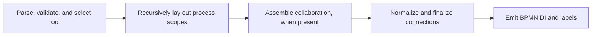
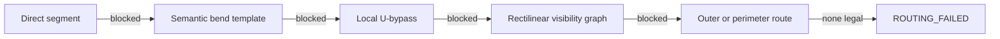
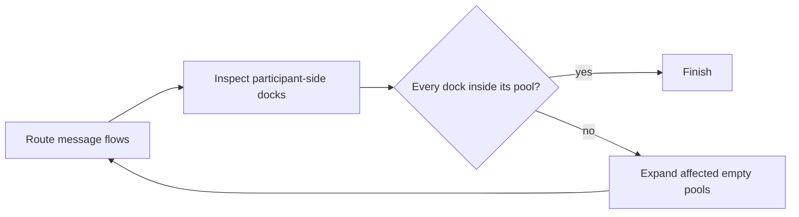

# How layout works

`bpmn-auto-layout` turns semantic BPMN XML into complete BPMN DI. It recursively
lays out process and sub-process scopes, arranges collaboration participants,
routes connections, and emits shapes, edges, and labels. This document explains
the resulting geometry and the algorithm that produces it.

## Layout contract

Generated process flow reads from left to right. The engine prioritizes:

1. valid geometry: containment and docking are correct, unrelated shapes do not
   overlap, and edges do not pass through unrelated shapes;
2. narrative: the primary path is continuous, branches are distinguishable,
   and exception paths remain separate from normal flow;
3. polish: fewer crossings, bends, long edges, and unused space.

Layout is greenfield. Existing coordinates, dimensions, waypoints, and labels
are discarded. Existing DI only determines whether an embedded sub-process is
expanded.

Equal alternatives are resolved by BPMN declaration order. The same semantic
input therefore produces byte-identical output.

## Algorithm overview

BPMN is directed, nested, and lane-constrained. The engine uses a constrained
layered layout:

- **ranks** establish left-to-right progress;
- **semantic bands** establish vertical narrative roles;
- **containers** recursively constrain child layouts;
- **orthogonal routing** connects final shape positions.

This is a BPMN-specific layered algorithm, not a generic graph layout followed
by BPMN patches.


```mermaid
flowchart LR
    A["Parse, validate, and select root"] --> B["Recursively lay out process scopes"]
    B --> C["Assemble collaboration, when present"]
    C --> D["Normalize and finalize connections"]
    D --> E["Emit BPMN DI and labels"]
```

Within each process scope, the engine analyzes cycles and narrative structure,
places flow nodes and containers, routes sequence flows, and then places
artifacts and groups. A collaboration composes those completed process layouts,
orders and aligns their participants, and routes message flows.

The layout state for each process, sub-process, or collaboration scope contains
shape bounds, edge waypoints, and child layouts. Its fields have one-way
ownership:

| Field | Owner | Meaning |
| --- | --- | --- |
| `scope` | scope extraction | The semantic BPMN scope represented by this layout. |
| `children` | recursive scope layout | Independently laid-out child scopes. |
| `shapes` | placement and container stages; message-routing fixed point | Bounds for elements on this scope's plane. |
| `edges` | routing and connection finalization | Waypoints for connections on this scope's plane. |
| `emitInParent` | container placement | Whether a child scope's geometry is included on its parent's plane. |

Semantic policy produces placement decisions without mutating geometry.
Placement writes shape bounds, routing writes initial edge waypoints, and the
message-routing fixed point may enlarge resizable participant bounds.
Connection finalization may repair only edge waypoints. External-label layout
then computes label bounds from finalized plane geometry. Diagram generation
reads that complete geometry without changing it and creates all BPMN DI.

## Input and validation

[`layoutProcess`](../lib/index.js) parses XML with `bpmn-moddle`, selects a
collaboration when one exists or otherwise the first process, removes existing
diagrams, generates new geometry, and resolves with `{ xml, warnings }`.

The engine rejects input for which valid geometry would be misleading or
undefined. [`LayoutError`](../lib/LayoutError.js) provides stable codes for:

- invalid or cross-scope sequence flows;
- invalid message-flow endpoints;
- invalid boundary-event hosts;
- incompatible lane membership;
- invalid link-event pairs;
- invalid participant process references;
- unsupported visual elements;
- collaborations without at least one participant that references a process;
- routes that cannot avoid unrelated shapes;
- artifact or external-label searches that cannot find collision-free geometry.

Non-fatal omissions are reported as
[`LayoutWarning`](../lib/LayoutWarning.js) instances. After DI emission, the
engine checks every supported visual shape and connection across all generated
planes. `DI_NOT_CREATED` reports a semantic element for which no corresponding
shape or edge was emitted. A group whose category value has no visible
explicitly referenced members is omitted with `GROUP_MEMBERS_NOT_FOUND`.

An empty definitions document remains valid and receives no invented process.

## Recursive scope layout

Each process and sub-process is laid out independently. `layoutProcessScope`
separates:

- ordinary flow nodes and sequence flows;
- boundary events and their handlers;
- event sub-processes;
- artifacts and associations.

Every extracted process flow node or artifact receives a working record with
its BPMN element, declaration index, default size, boundary/artifact
classification, expansion state, optional child layout, and eventual bounds.
Sub-process contents are laid out before their parent.

Expanded sub-processes contain their child geometry on the parent plane.
Collapsed sub-processes remain one parent-level activity and receive a separate
plane for their child process.

## Semantic policy

### Components and starts

Weakly connected components include ordinary sequence flows and boundary
handlers. A component starts at:

1. its earliest declared start event;
2. otherwise its earliest node without an incoming sequence flow;
3. otherwise its earliest declared node.

Normal disconnected components are laid out independently and stacked
vertically in declaration order. Adding a later component does not move an
earlier one.

### Primary path

The primary path, or spine, is selected one edge at a time:

1. prefer an edge whose target can reach an end event;
2. among eligible edges, prefer the BPMN default flow;
3. otherwise use declaration order.

This prevents a dead-end alternative from becoming the main narrative merely
because it was declared first. The selected edge and deterministic
single-outgoing continuations are marked straight and routed before alternatives.

When unobstructed, a spine edge is one horizontal segment from the source's
right center to the target's left center.

### Semantic bands

Band `0` is the spine. Other bands encode branch meaning:

- alternatives without a default alternate below, above, farther below, and
  farther above;
- alternatives to a default flow fan to one side;
- alternatives from an off-spine gateway fan farther away from the spine;
- error handlers occupy lower bands;
- escalation handlers occupy upper bands;
- paired link events align the catch continuation with the throw until that
  continuation rejoins other flow.

A band reservation includes the ranks over which its path exists. Disjoint
paths may reuse a physical band; overlapping narratives may not.

Boundary events stay attached to their host. Escalation events use the top host
edge and other boundary events use the bottom edge. Events sharing a host side
are ordered by their handlers' outward destination distance, longest first;
declaration order breaks equal-distance ties. Handler flows leave through the
outside-facing side and never enter the host interior.

Named events attached to the top edge receive an explicit external label above
the event and beside the handler exit, opposite its first horizontal direction.

## Cycles, ranks, and coordinates

`markBackEdges` performs a deterministic depth-first traversal from semantic
starts. The cycle graph includes ordinary sequence flows and an implicit edge
from each boundary-event host into its handler path. Edges that close a cycle
are temporarily excluded from rank assignment and later routed as feedback
edges.

`assignRanks` computes longest-path ranks over the remaining DAG. Boundary
handlers participate in a bounded fixed-point pass so their targets cannot
precede their hosts.

Rank assignment applies three BPMN-specific refinements:

- Detached, non-cyclic alternatives may reserve a horizontal bay before the
  spine continues. Boundary-handler paths reserve their complete single-lane
  span, allowing nearby alternatives to reuse bands.
- A boundary handler with a reserved bay claims the closest available band
  before a gateway alternative on the same side of the spine.
- Nested joins of the same gateway type may share a rank and connect vertically.
  Different gateway types retain a forward step.

Each rank becomes an x-position. Its width is the widest node in that rank.
Each semantic band becomes a y-position. Nodes sharing a rank and band are
separated in declaration order.

Semantic analysis compacts non-overlapping band intervals before any bounds are
created. Shape placement then proceeds in this order:

1. create initial coordinates from ranks and compacted bands;
2. clear boundary-handler exits;
3. separate same-rank shape overlaps inside each component;
4. pack disconnected components;
5. apply lane membership;
6. dock boundary events.

Geometry uses these base constants:

| Constraint | Value |
| --- | ---: |
| Horizontal gap | 100 px |
| Vertical gap | 80 px |
| Outer shape margin | 80 px |
| Expanded sub-process padding | 40 px |
| Named expanded sub-process title band | 28 px |
| Group padding | 40 px |
| Routing margin | 20 px |
| Participant header width | 30 px |
| Lane content padding | 40 px |

Layout may add space for containers and routing; it does not reduce these gaps.
Bounds and waypoints are normalized to integers before DI emission.

## Ad-hoc sub-processes

Ad-hoc semantics do not impose an execution order on disconnected children.
Using the normal vertical component stack would therefore create long, sparse
containers.

The ad-hoc policy compacts without reading labels or authored coordinates:

- for a split whose branches reconverge, normal primary-path semantics choose
  the horizontal continuation while alternate paths use reduced rank weights
  and vertical space;
- disconnected components are packed in two dimensions toward a square
  footprint;
- component footprints include routing gaps, so packing does not create a shape
  arrangement the router cannot use.

Connected components still preserve their sequence-flow order.

## Containers, lanes, and artifacts

### Sub-processes

An expanded embedded sub-process is sized around its child layout with the
configured padding and a minimum size of 140 x 120 px. A named sub-process
reserves the fixed title band inside its top padding; multiline titles do not
enlarge it.

If an external label has no close preferred position other than that title
band, the complete child layout moves down by its height so the label can remain
adjacent to its owner. Parent sequence flows dock at the sub-process perimeter;
child flows remain inside.

A collapsed sub-process uses normal activity dimensions in its parent. Its child
plane is normalized independently and has no coordinate relationship to the
collapsed parent shape.

Event sub-processes are placed after normal flow so they do not claim a normal
rank or band.

### Lanes

Lanes are horizontal and may be nested. A node occupies its unique deepest
lane. Redundant membership in an ancestor lane is valid; membership in
incomparable lanes is not.

Nodes retain their semantic rows inside lanes, and lane bounds expand to contain
them. Sequence flows may cross any number of sibling lanes. Lane regions are
traversable; flow-node shapes in intervening lanes remain routing obstacles.

### Artifacts

Text annotations and data references are decorations: they never influence
ranks, semantic bands, or flow-node placement. Process and sub-process artifacts
are placed after sequence flows; collaboration artifacts are placed after
message flows. Core connections treat artifacts as transparent routing geometry.

#### Placement rules

- Artifacts with more associations are placed first, followed by larger
  artifacts and then declaration order.
- Candidates avoid flow-node shapes, routes already present on the plane,
  previously placed artifacts, boundary-handler exits, and participant headers.
- An artifact must be wholly inside or wholly outside each sub-process, lane, and
  participant; it may not straddle a container boundary.
- Artifacts emitted on the same BPMN plane share one collision domain, including
  artifacts from visible expanded child scopes.
- Associations are routed only after both endpoint bounds are available.
  Parent- and collaboration-scope artifacts may therefore connect to visible
  elements inside expanded sub-processes or participant processes.

#### Text annotations

Annotation sizes come from deterministic word wrapping over bounded candidate
widths. Placement searches above, below, left, and right of the owner and slides
along those sides when blocked. It prefers a short direct association, then a
readable aspect ratio, fewer crossings, less diagram expansion, and proximity
to the preferred side.

Annotations may sit outside their owner's container, but never across its
boundary. Process annotations attached to message endpoints reserve the future
vertical message-flow approach. In collaborations they prefer participant sides
that do not expand participant rows. A collaboration annotation associated with
a single participant instead prefers a centered position above or below it.
Participant sizing ignores exterior annotations, while participant spacing
still includes their footprint.

#### Data references

Data object and data store references retain their standard dimensions and
receive candidates around every distinct owner. Their placement minimizes, in
order, flow crossings, insufficient shape clearance, missing owner alignment,
association bends, and owner-balanced route length. Repeated read/write
associations therefore do not pull a reference toward only one owner.

Data object references remain inside their owner's lane. Their associations,
and data store associations, use clear orthogonal routes with normal endpoint
legs. Repeated associations receive distributed docking points rather than
overlapping one another.

#### Groups

Groups are placed after artifacts and routing. Membership is explicit: a node
or connection belongs to a group when its `categoryValueRef` contains the
group's category value. Group bounds are the union of member shape bounds and
member connection waypoints, expanded by the configured group padding.

Groups are transparent to routing and hard overlap metrics. Their category
value is shown as an external label above the group. Groups without visible
explicit members remain semantic-only and are omitted; authored group DI is not
used to infer membership.

## Sequence-flow routing

Sequence-flow routing starts only after ordinary flow-node, lane, boundary-event,
and expanded-child coordinates used by sequence flows are final. Event
sub-process containers, artifacts, and groups are placed later because they do
not participate in parent-scope sequence-flow routing.

Spine edges and other marked straight continuations are routed first, followed
by cross-band gateway branches, other detours, and feedback edges. Cross-band
gateway branches claim their constrained top or bottom channels before same-band
detours choose an outer depth. Later edges treat accepted routes as allocated
geometry.

Ports follow semantics:

- same-band forward flows leave right and enter left;
- cross-band gateway branches leave through the top or bottom;
- joins may enter vertically;
- boundary handlers leave through the outside-facing side;
- self-loops route locally around their source;
- feedback and shape-spanning forward edges use nested outer channels;
- U-routed edges try the opposite local side, with matching endpoint ports,
  before escalating when their preferred side is blocked. Nested routes retain
  the bottom-side channel order. For an isolated gateway default flow, both
  local sides are compared at the same constraint level; the shorter route wins
  and equal routes use the top channel as the deterministic tie-break. Local
  U-channels include rendered-stroke clearance around unrelated shapes.

The boundary-event placement order described above creates nested vertical exits
without weaving.

The router escalates from the simplest candidate to the most general:


```mermaid
flowchart LR
    A["Direct segment"] -->|blocked| B["Semantic bend template"]
    B -->|blocked| C["Local U-bypass"]
    C -->|blocked| D["Rectilinear visibility graph"]
    D -->|blocked| E["Outer or perimeter route"]
    E -->|none legal| F["ROUTING_FAILED"]
```

The rectilinear visibility graph uses x- and y-coordinates derived from endpoint
ports, shape margins, and outer bounds. Dijkstra-style shortest-path search
chooses a legal orthogonal path. Grid construction is capped at 4,096 candidate
points. Above that bound the router skips directly to its bounded outer and
perimeter fallbacks instead of materializing a potentially quadratic grid.

A segment is legal when it:

- does not enter an unrelated shape;
- does not properly cross an allocated edge;
- does not create a forbidden positive-length overlap.

Shared endpoints, endpoint touches, and intentional shared endpoint channels
are not proper crossings. Channels may be shared regardless of whether
connections enter or leave their common endpoint.

## Collaborations and message flows

### Participant sizing

Every participant with a process reference contains an independently laid-out
process. Its pool is sized around that process. Participants without process
content are positioned and minimally sized from message-flow anchors, whether
they have an empty process or no process reference. An empty process-backed pool
keeps its alignment when all anchors already fit with header clearance.

For process participants without lanes, the participant header precedes the
normal process-content padding without consuming it. Lane-backed participants
start their lane tiles after the header and use the configured lane padding.

### Ordering and alignment

Vertical participant order follows message-flow relationships:

- up to eight participants use exhaustive permutation search;
- larger collaborations use deterministic greedy insertion followed by
  remove-and-reinsert refinement.

With one process-backed participant, connected black-box pools first prefer
adjacency and then shorter, straighter message travel. With multiple
process-backed participants, connected rows also prefer less vertical
separation.

The largest process footprint anchors horizontal alignment. Other process
layouts may translate as a unit to align endpoint centers or usable participant
edge intervals. Candidate positions are scored using fully rerouted message
geometry: crossings, bends, longest route, total distance, and displacement.
Large collaborations prioritize bends before crossings; smaller ones use
crossings first. Single-process collaborations keep their process position.

Disconnected message-flow components are translated to a common left edge.
Consecutive black-box participants may share a row when they retain the normal
horizontal gap; process-backed participants always occupy an exclusive row.

### Message routing

Message flows are generated when both endpoints resolve to visible layout
geometry. An endpoint inside a collapsed sub-process resolves to its nearest
visible collapsed ancestor. Opposing directions receive stable channel offsets.
Adjacent pools use their shared gutter; non-adjacent pools may use an outside
channel. Large collaborations also consider endpoint-aligned corridors and the
sides of intervening pools before either diagram exterior.

Routes avoid process-node obstacles. Horizontal segments claim exclusive
y-channels; perpendicular vertical segments may cross them without forming a
junction.

Empty pool sizing and message routing form a fixed point:


```mermaid
flowchart LR
    A["Route message flows"] --> B["Inspect participant-side docks"]
    B --> C{"Every dock inside its pool?"}
    C -->|yes| D["Finish"]
    C -->|no| E["Expand affected empty pools"]
    E --> A
```

Participant docks remain inside their pool while routing. Empty pools expand
around uncovered docks and reroute until every dock fits.

## Connection finalization and diagram generation

The layout is translated so its minimum shape extents begin at the outer shape
margin. Edge waypoints move by the same offset and may occupy that routing
space. [`FinalizeConnections`](../lib/layout/connections/FinalizeConnections.js)
then finalizes connection geometry. [`DiagramGeneration`](../lib/layout/DiagramGeneration.js)
computes external-label bounds for every independent plane before
[`DiFactory`](../lib/di/DiFactory.js) creates any BPMN DI.

Expanded child layouts are emitted on their parent plane. Collapsed sub-process
children are normalized and emitted recursively on separate planes. Diagram
generation owns that traversal and returns the complete diagram collection.

### Docking repair

Before serialization, finalization enforces these endpoint contracts:

- Endpoint segments leave and enter through an unambiguous shape side. Tangent
  segments are redirected, interior waypoints are removed, and a short dogleg
  preserves an outward approach when needed.
- Corner dockings move one routing margin inward along the intended side.
- Boundary handlers leave the event's top or bottom center through a vertical
  stub and approach their target through a facing side.
- Clear three-point sequence-flow elbows are centered on shape sides.
  Obstructed cross-band elbows try the facing gap, transposed sides, and then
  global routing.

Crossing-free candidates are preferred, but an unavoidable edge crossing never
permits ambiguous corner docking.

### External labels

Named events, gateways, data references, sequence flows, message flows, and
groups receive external label bounds after connection finalization and before
BPMN DI creation. Label width is estimated from wrapped text and capped at 90 px.

- Shape labels try below, above, left, and right; group labels try above first.
- Horizontal connection labels try above then below; vertical labels try right
  then left.
- Unique portions near a connection's center are tried before shared trunks.
- Candidates avoid shapes, connection interiors, other labels, participant
  headers, sub-process title areas, and container borders. Their direct visual
  attachment to the owner must also remain clear.

If preferred positions are occupied, a bounded expanding search chooses the
nearest clear fallback without changing connection routes. Unknown visual
elements never receive task-sized fallback geometry.

## Execution architecture

The [`layout` entrypoint](../lib/layout/index.js) owns parsing and root
selection, delegating process scopes to [`process`](../lib/layout/process/index.js)
and collaborations to [`collaboration`](../lib/layout/collaboration/index.js).
It passes the complete layout tree to the deep
[`DiagramGeneration`](../lib/layout/DiagramGeneration.js) module,
which owns normalization, finalization, external labels, plane traversal, and
DI output behind one interface. Process and collaboration entrypoints build
their contexts and run private immutable phase lists. Nested process scopes
re-enter the same fixed lifecycle.

### Process pipeline

```text
extractElements
→ layoutChildScopes
→ validateScope
→ analyzeSemantics
→ placeFlowNodes
→ placeExpandedChildren
→ routeSequenceFlows
→ placeEventSubProcesses
→ placeArtifacts
→ placeGroups
```

Each step receives and returns one context containing the scope and recursive
options, extracted elements, graph and semantic state, mutable placement
records, layout state, and warnings. Extraction initializes elements and
placement; semantic analysis replaces graph and policy state without writing
geometry. Placement writes shape bounds, routing writes edge waypoints, and
nested scopes re-enter the process entrypoint through a private callback.

### Collaboration pipeline

```text
validateCollaboration
→ layoutParticipants
→ orderParticipants
→ positionParticipants
→ compactParticipantRows
→ routeMessageFlows
→ placeArtifacts
```

The collaboration context tracks participant layouts, ordering, geometry, and
warnings. Its phases live with their domain implementations; message routing may
expand resizable participant bounds until every participant-side dock fits.

Reusable context contracts live in
[`Types.ts`](../lib/layout/Types.ts). Runtime modules reference them through
type-only JSDoc imports.

Process, collaboration, artifact, and connection-finalization routing reuse the
shared orthogonal search where their geometric contracts match. BPMN endpoint
and shared-channel semantics remain in its adapter.

### Decomposition standard

Entrypoints and major domain operations read top-down as named phases or
decisions. Independently meaningful classification, preparation, candidate
generation, validation, scoring, fallback, and application steps are extracted.

Decomposition follows concepts rather than line counts. Cohesive graph-search,
route-scoring, and candidate-construction kernels remain intact when splitting
would obscure shared invariants. Generic utility modules and wrapper-only
modules are avoided.

Focused specs use the implementation concept's name and protect boundaries that
snapshots do not explain. Snapshot fixtures remain the integration contract for
complete generated geometry.

## Implementation map

| Concern | Main implementation |
| --- | --- |
| Layout engine entrypoint | [`layout/index.js`](../lib/layout/index.js) |
| Process pipeline and stages | [`process/`](../lib/layout/process) |
| Collaboration pipeline and geometry | [`collaboration/`](../lib/layout/collaboration) |
| Spine, components, bands, cycles, and ranks | [`process/semantics/`](../lib/layout/process/semantics) |
| Coordinates, component packing, and boundary events | [`process/placement/ShapePlacement.js`](../lib/layout/process/placement/ShapePlacement.js) |
| Lane membership, measurement, and placement | [`process/placement/LanePlacement.js`](../lib/layout/process/placement/LanePlacement.js) |
| Participant container bounds and expanded sub-processes | [`process/placement/ParticipantBounds.js`](../lib/layout/process/placement/ParticipantBounds.js), [`process/placement/ExpandedSubProcess.js`](../lib/layout/process/placement/ExpandedSubProcess.js) |
| Sequence-flow routing | [`process/routing/`](../lib/layout/process/routing) |
| Shared orthogonal search and BPMN routing adapter | [`routing/`](../lib/layout/routing) |
| Artifact context and ownership | [`artifacts/Context.js`](../lib/layout/artifacts/Context.js), [`artifacts/Ownership.js`](../lib/layout/artifacts/Ownership.js) |
| Artifact placement and candidate generation | [`artifacts/Placement.js`](../lib/layout/artifacts/Placement.js), [`artifacts/PlacementCandidates.js`](../lib/layout/artifacts/PlacementCandidates.js) |
| Artifact obstacle and association routing | [`artifacts/ObstacleRoutes.js`](../lib/layout/artifacts/ObstacleRoutes.js), [`artifacts/AssociationRouting.js`](../lib/layout/artifacts/AssociationRouting.js) |
| Explicit group bounds | [`groups/LayoutGroups.js`](../lib/layout/groups/LayoutGroups.js) |
| External label placement | [`labels/`](../lib/layout/labels) |
| Layout state and geometry | [`geometry/`](../lib/layout/geometry) |
| BPMN predicates and validation | [`bpmn/`](../lib/layout/bpmn) |
| Final connection docking | [`connections/`](../lib/layout/connections) |
| Diagram generation and DI output | [`DiagramGeneration.js`](../lib/layout/DiagramGeneration.js), [`DiFactory`](../lib/di/DiFactory.js) |

## Maintaining the contract

For an intentional behavior change:

1. update the focused spec or a minimal [`LayoutSpec.js`](../test/LayoutSpec.js)
   [fixture](../test/fixtures);
2. inspect snapshots and corpus metrics as described in
   [`test/README.md`](../test/README.md);
3. update this document when the rule or mechanism changes.

Snapshots record exact geometry; metrics expose quality trends. Wrong-way
docking and non-orthogonal connection counts must remain zero across the fixture
corpus. Neither replaces visual review.
