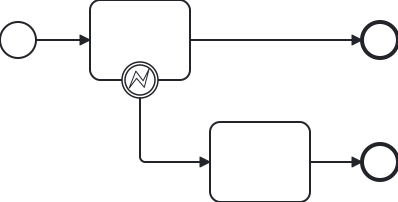
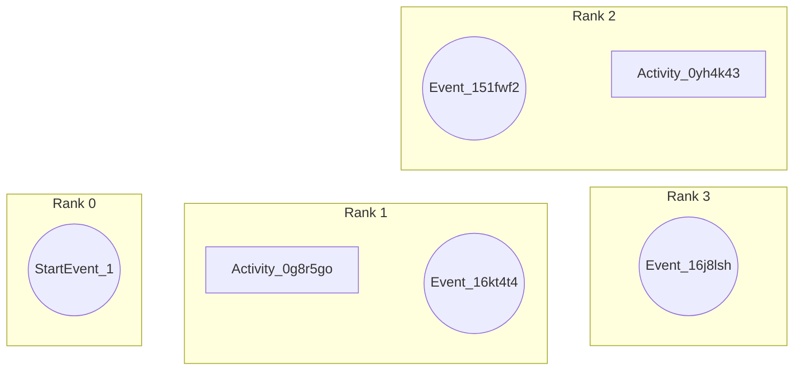

# End-to-end layout walkthrough

This walkthrough follows
[`boundary-event.error-no-ref.bpmn`](../test/fixtures/boundary-event.error-no-ref.bpmn)
through every layout stage. It is deliberately small enough to inspect by hand,
while exercising greenfield DI, primary-path selection, error-handler bands,
boundary-event docking, and orthogonal routing.

Run the fixture while reading:

```sh
npm test -- --grep "boundary-event.error-no-ref.bpmn"
```

The test writes the generated BPMN to
`test/output/boundary-event.error-no-ref.bpmn` and compares it with
[`test/snapshots/boundary-event.error-no-ref.bpmn`](../test/snapshots/boundary-event.error-no-ref.bpmn).

## 1. Input

The process has a normal path and an error-handler path:



`Event_16kt4t4` is a boundary event attached to `Activity_0g8r5go`. Its
`bpmn:errorEventDefinition` has no `errorRef`. That does not affect the visual
policy: an error boundary handler is a lower-band handler. An escalation
boundary handler would instead use an upper band.

The fixture includes authored BPMN DI, but layout is greenfield. `layoutProcess`
keeps the semantic BPMN elements and discards all existing diagrams, including
their bounds and waypoints. The authored positions therefore do not influence
any result below.

## 2. Parse, select, and validate

`layoutProcess` parses the XML, selects `Process_1` as the root, and creates
one scope layout. It validates that every sequence flow endpoint is a flow node
in `Process_1` and that the boundary event attaches to an activity in the same
scope. This fixture has no lanes, nested scopes, artifacts, or collaboration
participants, so those policies do not add geometry.

The scope separates its elements as follows:

| Kind | Elements |
| --- | --- |
| Graph nodes | `StartEvent_1`, `Activity_0g8r5go`, `Event_151fwf2`, `Activity_0yh4k43`, `Event_16j8lsh` |
| Ordinary sequence flows | `Flow_0xa120e`, `Flow_0tttwsc`, `Flow_1kozs17` |
| Boundary event | `Event_16kt4t4` |
| Boundary handler flow | `Flow_05xh0nm` |

The boundary event itself is not a graph node. Its outgoing flow is modelled
as an implicit connection from its host to the handler target for component,
band, and rank decisions.

## 3. Select the primary path and semantic bands

All nodes belong to one weakly connected component because the boundary handler
connects its host to `Activity_0yh4k43`. The start event is the component seed.

The normal sequence flows both reach `Event_151fwf2`, so they become the
primary path (the spine):

```text
StartEvent_1 --Flow_0xa120e--> Activity_0g8r5go
             --Flow_0tttwsc--> Event_151fwf2
```

The error boundary handler is not an alternate spine edge. It is assigned the
first lower semantic band, along with its continuation:

| Element | Role | Semantic band |
| --- | --- | ---: |
| `StartEvent_1`, `Activity_0g8r5go`, `Event_151fwf2` | spine | 0 |
| `Activity_0yh4k43`, `Event_16j8lsh` | error handler | 1 |

There are no cycles, so no edge is reserved as a feedback edge. The handler
band reserves ranks 1 through 2 so that its exit remains separate from the
normal narrative.

Internally, the semantic-policy stage produces maps and sets. The following is
a normalized, ID-based view of the decisions relevant to this fixture; it is
illustrative documentation, not an exported API:

```json
{
  "spine": [
    "Flow_0xa120e",
    "Flow_0tttwsc"
  ],
  "straightEdges": [
    "Flow_0xa120e",
    "Flow_0tttwsc"
  ],
  "bands": {
    "StartEvent_1": 0,
    "Activity_0g8r5go": 0,
    "Event_151fwf2": 0,
    "Activity_0yh4k43": 1,
    "Event_16j8lsh": 1
  },
  "components": {
    "StartEvent_1": 0,
    "Activity_0g8r5go": 0,
    "Event_151fwf2": 0,
    "Activity_0yh4k43": 0,
    "Event_16j8lsh": 0
  },
  "edgeOrder": {
    "Flow_0xa120e": 0,
    "Flow_0tttwsc": 1,
    "Flow_1kozs17": 2,
    "Flow_05xh0nm": 3
  },
  "backEdges": []
}
```

## 4. Assign ranks

Ranks establish horizontal progress. The spine advances one rank per flow. The
boundary fixed-point pass places the handler target one rank after its host,
then its ordinary outgoing flow advances the handler end event:

| Element | Reason | Rank |
| --- | --- | ---: |
| `StartEvent_1` | component start | 0 |
| `Activity_0g8r5go` | one spine edge after start | 1 |
| `Event_151fwf2` | one spine edge after task | 2 |
| `Activity_0yh4k43` | one boundary-handler step after host | 2 |
| `Event_16j8lsh` | one handler flow after task | 3 |

The columns below are ranks; the two rows are semantic bands. The boundary
event is shown in its host's rank-1 column because it is attached to that task,
but it is not itself assigned a graph rank.



The normal end event and handler task share rank 2 but occupy different bands:
the spine is above and the error handler is below.

## 5. Place shapes and dock the boundary event

Each rank takes the width of its widest shape, followed by the 100 px horizontal
gap. Each band uses 80 px of band height plus the 80 px vertical gap. The
component is then packed and the whole layout is translated so its minimum shape
extent starts at the 80 px outer margin.

The resulting shape bounds are:

| Element | x | y | Width | Height |
| --- | ---: | ---: | ---: | ---: |
| `StartEvent_1` | 80 | 102 | 36 | 36 |
| `Activity_0g8r5go` | 216 | 80 | 100 | 80 |
| `Event_151fwf2` | 448 | 102 | 36 | 36 |
| `Activity_0yh4k43` | 416 | 240 | 100 | 80 |
| `Event_16j8lsh` | 616 | 262 | 36 | 36 |

`Event_16kt4t4` is placed only after its host and handler are known. Because
it is an error event, it attaches to the host's bottom edge. With one bottom
attacher, it is centered on the host:

| Element | x | y | Width | Height |
| --- | ---: | ---: | ---: | ---: |
| `Event_16kt4t4` | 248 | 142 | 36 | 36 |

This leaves the event's bottom center at `(266, 178)`, already facing the
lower handler band.

## 6. Route sequence flows

The router handles spine edges first, then the handler continuation, then the
boundary-handler flow. It treats previously accepted routes as allocated
geometry. All four paths are clear here, so no visibility graph or outer route
is necessary:

| Flow | Route kind | Waypoints |
| --- | --- | --- |
| `Flow_0xa120e` | direct spine | `(116, 120)` -> `(216, 120)` |
| `Flow_0tttwsc` | direct spine | `(316, 120)` -> `(448, 120)` |
| `Flow_1kozs17` | direct handler continuation | `(516, 280)` -> `(616, 280)` |
| `Flow_05xh0nm` | boundary branch | `(266, 178)` -> `(266, 280)` -> `(416, 280)` |

The boundary route begins with a vertical outward segment from the event's
bottom center, then turns right into the handler task's left center. It never
passes through the attached task.

## 7. Normalize and emit DI

`LayoutEmitter` rounds bounds and waypoints, removes redundant collinear points,
and verifies that endpoint segments leave and enter their shapes through an
outward-facing side. It emits a new `BPMNDiagram_Process_1` and
`BPMNPlane_Process_1`, with `BPMNShape_*` and `BPMNEdge_*` IDs derived from the
semantic element IDs.

The fixture's boundary event has no name, so it receives no explicit label DI.
The generated DI is byte-for-byte equal to the committed snapshot.

## 8. Inspect the result

To review the original DI, current output, and committed snapshot side by side:

```sh
npm run test:inspect
```

For standalone SVG and PNG artifacts for this one valid fixture:

```sh
npm run render:fixture -- boundary-event.error-no-ref
```

## What this example demonstrates

The input has no explicit error reference and no useful authored geometry. The
output remains deterministic because the event type, attachment, sequence-flow
order, default sizes, and fixed layout constants provide every decision needed:
the normal path stays horizontal, and the error path leaves the host downward
into a separate, obstacle-free band.
