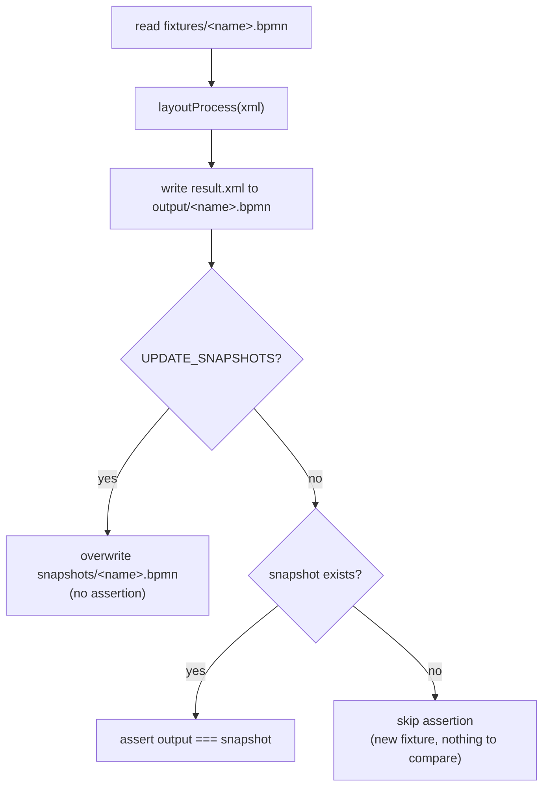

# Test suite

This directory contains two complementary ways to evaluate layout output:

| Check | Command | Purpose | Gate |
| --- | --- | --- | --- |
| Snapshot regression suite | `npm test` | Detect every byte-level change to generated BPMN XML. | yes |
| Layout-quality metrics | `npm test` or `npm run metrics` | Reject ambiguity defects and report narrative/polish deltas. | yes |

Both use every `.bpmn` file in [`fixtures/`](fixtures). Snapshot tests protect
against unintended changes; metrics indicate whether an intentional change
improves or regresses layout quality. The visual inspector supports review of
the snapshot suite. Each fixture header also shows its generated layout metrics
and the delta from the recorded metrics baseline; green and orange metric cards
indicate an improvement or regression for metrics with a preferred direction.
Non-fatal layout warnings are shown below the metrics for the fixture that
produced them.

## Snapshot regression suite

For every input diagram, [LayoutSpec.js](LayoutSpec.js) runs the layouter and
compares the produced XML byte-for-byte against a previously recorded "known
good" output. A difference fails the test, showing that the layout *changed* —
not necessarily that it got worse.

## The three directories

| Directory | Role | Committed? |
| --- | --- | --- |
| [`fixtures/`](fixtures) | **Inputs.** Source `.bpmn` files, typically with no (or partial) DI. | yes |
| [`snapshots/`](snapshots) | **Expected outputs.** The recorded "known good" layout for each fixture. | yes |
| `output/` | **Actual outputs** from the last run, plus an `index.html` inspector. | no (wiped each run) |

`output/` is deleted and rebuilt on every `npm test`, so never edit it by hand —
it is a scratch area, not a source of truth.

## How a single test works

For each `*.bpmn` file in `fixtures/`, the spec generates one `it(...)` case:



Tests are **discovered from the filesystem** — there is no manual list. Drop a
`.bpmn` file into `fixtures/` and it is picked up automatically on the next run.

### Fixture names

Normal fixtures use `<family>.<behavior>[-<qualifier>].bpmn`, in lowercase.
The family is the primary BPMN construct or a deliberate cross-cutting concern,
such as `gateway`, `sub-process`, `link-event`, or `scenario`. Reserve
`scenario` for engine-wide behavior such as determinism, input handling, and
generic process traversal. Failure fixtures remain flat, hyphenated behavior
names because `fixtures/failures/` supplies their fixture kind.

### Scenario descriptions

Every new fixture should place a concise statement of its intended layout
behavior in the root process's `bpmn:documentation` element. The visual
inspector displays this text below the fixture filename, so reviewers can judge
the rendered layout against its purpose. For example:

```xml
<bpmn:process id="Process_1" isExecutable="true">
   <bpmn:documentation>Start → task → task → end is one left-to-right, zero-bend spine.</bpmn:documentation>
   <!-- flow elements -->
</bpmn:process>
```

### Pass / fail condition

A test **passes** when `(await layoutProcess(fixture)).xml` produces XML that is
**exactly equal** (`assert.strictEqual`) to the committed snapshot. Because the
comparison is on the serialized string, *any* change — coordinates, waypoints,
attribute order — is a mismatch. That strictness is deliberate: it makes every
geometry change visible and reviewable in the diff.

A fixture with **no** matching snapshot file still runs (and writes `output/`),
but skips the assertion. This is how you stage a new fixture before recording its
baseline.

## Running the tests

```sh
# run every test-directory program (builds first, then runs Mocha)
# including snapshot assertions and the metrics harness
npm test

# run the suite, then open its visual inspector
npm run test:inspect

# re-record every snapshot from current output
npm run test:update-snapshots

# calculate layout-quality metrics and show their delta from the baseline
npm run metrics

# replace the recorded metrics baseline after reviewing an intentional change
npm run metrics:update
```

To render one normal fixture as paired human-authored input and current layout
artifacts:

```sh
npm run render:fixture -- gateway.multiple
```

The command writes `<fixture>.input.{png,svg}` from the fixture's existing DI
and `<fixture>.{png,svg}` from the current layouter output to
`output/rendered/`. It rejects failure fixtures.

`npm test` runs `pretest` (`rollup -c`) first, so the snapshot suite always
tests freshly built `dist/`, not stale output. Mocha discovers both
[LayoutSpec.js](LayoutSpec.js) and [metrics.mjs](metrics.mjs): it enforces the
snapshot assertions and runs the metrics harness. A metrics execution error or
Band-A defect fails the command. Polish-metric changes remain review signals,
not gates.

## Updating snapshots

Set the `UPDATE_SNAPSHOTS=true` environment variable (the
`test:update-snapshots` script does this for you). In that mode the `before` hook
**wipes the entire `snapshots/` directory**, and each test **writes** its output
as the new snapshot instead of asserting against it.

Use it when a layout change is **intentional**. The workflow is:

1. Make your change to `lib/`.
2. Run `npm test` and watch which fixtures fail.
3. Inspect the diffs visually (`npm run test:inspect`) and confirm the new
   layouts are actually what you want.
4. Only then run `npm run test:update-snapshots` to bless the new output.
5. **Review the snapshot diff in version control** — the committed `.bpmn` diff
   under `snapshots/` *is* the record of how the layout changed.

> Do not run `test:update-snapshots` reflexively to make a red suite green.
> A snapshot you didn't look at is not a test — it just locks in whatever the
> code happened to produce.

## The visual inspector

After every run the `after` hook builds `output/index.html` from
[template.html](template.html). It renders, side by side per fixture:

- the **input** diagram,
- the **current output**, and
- the **committed snapshot** (when one exists),

and flags whether output and snapshot match. `npm run test:inspect` runs the
suite to generate a fresh report, then opens it even if a snapshot assertion
fails. The command still exits with the test result.
This is how you *read* a failure — the string diff tells you bytes changed; the
inspector shows you what that looks like on the canvas.

The permanent issue badges for crossings, shape overlaps, label overlaps, shape
intersections, and wrong-way dockings show the number of fixtures with that
issue. Badges with no matching fixtures are disabled and gray; the others are
inactive by default and act as clickable filters. Multiple selected metrics show
only fixtures with every selected issue. Each active issue filter also
highlights the exact responsible geometry in generated-output viewers, including
maximized output and output/snapshot comparisons.

## Focusing and skipping fixtures

Prefix a fixture's **filename** to control which cases run, without touching the
spec (see the `iit` helper in [LayoutSpec.js](LayoutSpec.js)):

| Prefix | Effect | Mocha equivalent |
| --- | --- | --- |
| `ONLY` | run **only** this fixture (and other `ONLY`s) | `it.only` |
| `SKIP` | skip this fixture | `it.skip` |
| *(none)* | run normally | `it` |

For example, renaming `gateway.parallel.bpmn` to `ONLYgateway.parallel.bpmn`
isolates it while you iterate. Remember to rename it back before committing.

## Layout-quality metrics

Snapshot tests tell you that output *changed*; they do not tell you whether it
got *better*. The metrics harness, which is also run by `npm test`, fills that
gap. It lays out every fixture and computes twelve numbers per diagram from the
generated DI:

| Metric | Meaning | Lower is better |
| --- | --- | --- |
| `crossings` | edge-segment pairs that properly cross | yes |
| `overlaps` | node-pair bounds overlaps, excluding container nesting, boundary-on-host, and artifacts | yes |
| `edgeShapeIntersections` | edge interiors that pass through unrelated non-container, non-boundary, non-artifact shapes | yes |
| `wrongWayDockings` | endpoints off their shape perimeter or whose adjacent segment lacks an outward component normal to the docked side | yes |
| `bendCount` | direction changes in edge waypoint paths | yes |
| `averageEdgeLength` | average length of edge waypoint polylines | yes |
| `edgeSegmentLengthDeviation` | standard deviation of positive edge-segment lengths | yes |
| `labelShapeOverlaps` | explicit or renderer-derived external labels overlapping non-container flow-node shapes | yes |
| `labelEdgeOverlaps` | explicit or renderer-derived labels overlapping connection interiors, including their own connection | yes |
| `compactness` | flow-node area as a percentage of the flow-node and sequence-flow bounding box; diagrams without flow nodes score 0 | no |
| `gridAlignment` | flow nodes participating, within 1 px, in an alignment of at least three nodes, as a percentage; diagrams without flow nodes score 0 | no |
| `branchSymmetry` | targets reflected within 1 px across their gateway axis in non-default gateway fans, as a percentage; diagrams without eligible fans score 100 | no |

The pure computation lives in
[metrics/computeMetrics.js](metrics/computeMetrics.js); the runner and table are
in [metrics.mjs](metrics.mjs). The recorded baseline is
[metrics/baseline.json](metrics/baseline.json) — every later "this is better"
claim is a diff against those numbers, shown in the `Δ` column.

Overlaps, edge/shape intersections, and wrong-way docking are hard zero-defect
gates. Diagonal segments are valid when they point outward, but tangent endpoint
segments are not. All other metrics are quality signals to review before
updating [metrics/baseline.json](metrics/baseline.json). Use both:
snapshots guard exact output; metrics enforce validity and grade visual quality.

## Adding a new test case

1. Add `your-case.bpmn` to [`fixtures/`](fixtures) (semantics required; DI
   optional).
2. Run `npm test`. The case runs and writes `output/your-case.bpmn`, but makes
   no assertion yet (no snapshot to compare against).
3. Inspect the result with `npm run test:inspect`.
4. When it looks right, run `npm run test:update-snapshots` to record
   `snapshots/your-case.bpmn`.
5. Commit the fixture **and** the snapshot together.
