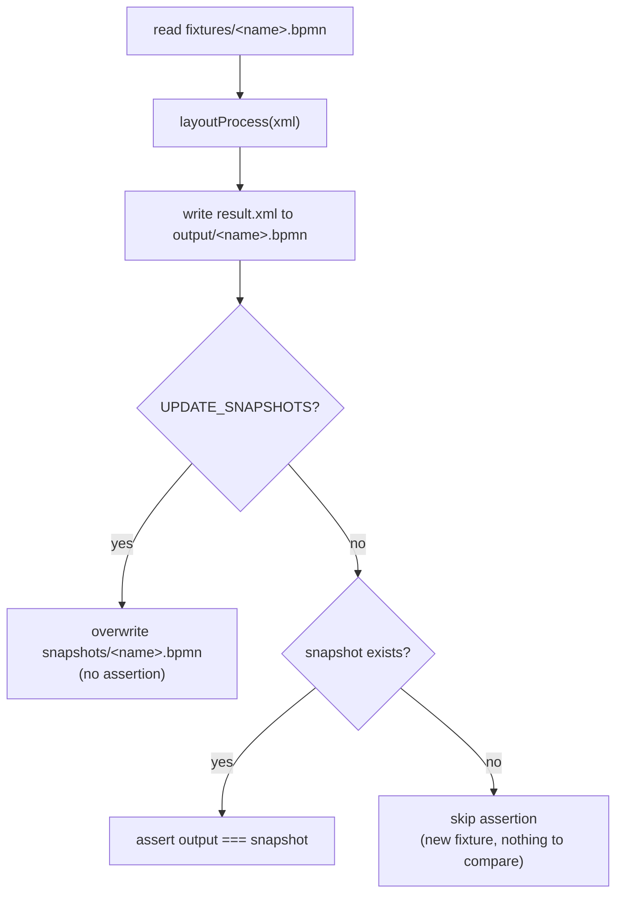

# Testing layout

Fixtures are executable layout contracts. The suite compares generated BPMN
against approved snapshots, measures visual quality, and enforces targeted
performance budgets.

| Check | Command | Purpose | Gate |
| --- | --- | --- | --- |
| Snapshot regression suite | `npm test` | Detect every byte-level change to generated BPMN XML. | yes |
| Layout-quality metrics | `npm test` or `npm run metrics` | Reject ambiguity defects; report narrative and polish deltas. | yes |
| Performance budgets | `npm run test:performance` | Enforce critical participant-ordering and collaboration limits. | CI |

Snapshot tests and metrics cover every `.bpmn` file in [`fixtures/`](fixtures).
Snapshots detect unintended output changes; metrics show whether an intentional
change improves or degrades layout quality. The visual inspector presents each
fixture's metrics, baseline delta, and non-fatal warnings. `npm run test:inspect`
also measures five layouts after one warm-up, ranks fixtures by p50, and shows
average, p50, and p90 durations. Timing is informational and never affects a
test result.

## Snapshot contract

[LayoutSpec.ts](LayoutSpec.ts) lays out every input diagram and compares the
result byte-for-byte with its approved snapshot. A mismatch proves that output
changed; it does not by itself judge the change.

## The three directories

| Directory | Role | Committed? |
| --- | --- | --- |
| [`fixtures/`](fixtures) | **Inputs.** Source `.bpmn` files, with no, partial, or authored DI. | yes |
| [`snapshots/`](snapshots) | **Expected outputs.** Approved generated BPMN for each fixture. | yes |
| `output/` | **Actual outputs.** Last-run BPMN and the `index.html` inspector. | no (wiped each run) |

`output/` is deleted and rebuilt on every `npm test`, so never edit it by hand —
it is a scratch area, not a source of truth.

## How a single test works

The spec generates one `it(...)` case for each `*.bpmn` file in `fixtures/`:


```mermaid
flowchart TD
    A["read fixtures/&lt;name&gt;.bpmn"] --> B["layoutProcess(xml)"]
    B --> C["write result.xml to output/&lt;name&gt;.bpmn"]
    C --> D{"UPDATE_SNAPSHOTS?"}
    D -- "yes" --> E["overwrite snapshots/&lt;name&gt;.bpmn<br/>(no assertion)"]
    D -- "no" --> F{"snapshot exists?"}
    F -- "yes" --> G["assert output === snapshot"]
    F -- "no" --> H["skip assertion<br/>(new fixture, nothing to compare)"]
```

Tests are **discovered from the filesystem** — there is no manual list. Drop a
`.bpmn` file into `fixtures/` and it is picked up automatically on the next run.

### Fixture names

Normal fixtures use `<family>.<behavior>[-<qualifier>].bpmn`, in lowercase.
The family is the primary BPMN construct or a deliberate cross-cutting concern,
such as `gateway`, `sub-process`, `link-event`, or `scenario`. Reserve
`scenario` for engine-wide behavior such as determinism, input handling, and
generic process traversal. Failure fixtures remain flat, hyphenated behavior
names because `fixtures/failures/` supplies their fixture kind.

### Scenario descriptions

Every new fixture should place a concise statement of its intended layout
behavior in the root process's `bpmn:documentation` element. The visual
inspector displays this text below the fixture filename, so reviewers can judge
the rendered layout against its purpose. For example:

```xml
<bpmn:process id="Process_1" isExecutable="true">
   <bpmn:documentation>Start → task → task → end is one left-to-right, zero-bend spine.</bpmn:documentation>
   <!-- flow elements -->
</bpmn:process>
```

### Pass / fail condition

A test **passes** when `(await layoutProcess(fixture)).xml` produces XML that is
**exactly equal** (`assert.strictEqual`) to the committed snapshot. Because the
comparison is on the serialized string, *any* change — coordinates, waypoints,
attribute order — is a mismatch. That strictness is deliberate: it makes every
geometry change visible and reviewable in the diff.

A fixture with no snapshot still runs and writes `output/`, but skips the
assertion. This lets a new fixture produce output for review before its baseline
is recorded.

## Running the tests

```sh
# run the full suite (builds first, then runs Mocha)
# including snapshot assertions and metrics
npm test

# run the suite, then open its visual inspector
npm run test:inspect

# re-record every snapshot from current output
npm run test:update-snapshots

# calculate layout-quality metrics and show their delta from the baseline
npm run metrics

# replace the recorded metrics baseline after reviewing an intentional change
npm run metrics:update
```

## Fixture benchmarking

Measure one normal fixture's `layoutProcess` time after 20 warm-up iterations:

```sh
npm run benchmark:fixture -- collaboration.message-flows 100
```

The required iteration count produces average, p50, and p90 timings. The
fixture may be given by name or as a path relative to `fixtures/`; failure
fixtures are rejected because they do not produce benchmarkable layout output.

`npm run test:performance` enforces p50 ceilings for the eight-participant
exact-ordering threshold and `process.application-processing.bpmn`. CI runs
these budgets on Node.js 24; normal correctness checks run on every supported
Node.js release line.

## Performance tracing

Capture a raw Chrome trace for one fixture with:

```sh
npm run trace:fixture -- collaboration.message-flows
```

The command builds a dedicated local trace page, invokes `layoutProcess` and
imports the generated diagram into a viewer, then saves a DevTools- and
Perfetto-compatible JSON trace under `test/performance/traces/`. Generated
traces are ignored by Git. The trace uses DevTools timeline and V8 CPU-profiler
categories and fails instead of saving a trace when Chrome reports data loss.

Render one normal fixture with authored DI as paired input and current-layout
artifacts:

```sh
npm run render:fixture -- gateway.multiple
```

The command writes `<fixture>.input.{png,svg}` from existing fixture DI and
`<fixture>.{png,svg}` from current layouter output to `output/rendered/`. It
rejects failure fixtures.

`npm test` runs `pretest` (`npm run build`) first, so the snapshot suite always
tests freshly built `dist/`, not stale output. Mocha discovers both
[LayoutSpec.ts](LayoutSpec.ts) and [metrics.test.ts](metrics.test.ts): it enforces the
snapshot assertions and runs the metrics harness. A metrics execution error or
Band-A defect fails the command. Polish-metric changes remain review signals,
not gates. The metrics suite has a 60-second timeout because it lays out the
entire fixture corpus; other tests retain the default 15-second timeout.

## Updating snapshots

Set the `UPDATE_SNAPSHOTS=true` environment variable (the
`test:update-snapshots` script does this for you). In that mode the `before` hook
**wipes the entire `snapshots/` directory**, and each test **writes** its output
as the new snapshot instead of asserting against it.

Use it only to re-record the complete, reviewed fixture corpus. For a single
new fixture, copy its reviewed output from `output/` into `snapshots/` instead.

The full-corpus workflow is:

1. Make your change to `lib/`.
2. Run `npm test` and watch which fixtures fail.
3. Inspect the diffs visually (`npm run test:inspect`) and confirm the new
   layouts are actually what you want.
4. Run `npm run test:update-snapshots` only after that review.
5. Review the snapshot diff in version control. The committed `.bpmn` diff in
   `snapshots/` records the layout change.

> Never use snapshot updates to turn a failing suite green without reviewing the
> generated layout.

## Reviewing snapshot changes in a pull request

Generate a base-versus-head comparison locally with:

```sh
npm run review:layout -- --base origin/main
```

The command writes `test/output/layout-review/index.html`. It includes only
snapshot files changed between the base and head revisions, showing the
previous snapshot behind the proposed snapshot and reporting metric deltas.
New normal fixtures without matching snapshots fail the command.

After pull-request CI succeeds, the trusted `Layout Review` workflow publishes
the same comparison under the repository's GitHub Pages site. It creates or
updates one `Layout change report` comment on the pull request with a link for
the exact head commit. The report describes snapshot changes without treating
them as test failures; normal snapshot tests separately guarantee that current
layout output matches the proposed snapshots.

## The visual inspector

After every run the `after` hook builds `output/index.html` from
[template.html](template.html). It renders, side by side per fixture:

- the **input** diagram,
- the **current output**, and
- the **committed snapshot** (when one exists),

and flags whether output and snapshot match. `npm run test:inspect` runs only
the fixture snapshot suite needed to generate a fresh report, then opens it
even if a snapshot assertion fails. The command still exits with the snapshot
test result; run `npm run metrics` separately to review the aggregate metrics
gate.
The string diff identifies changed bytes; the inspector shows the resulting
geometry.

The permanent issue badges for crossings, shape overlaps, label overlaps, shape
intersections, and wrong-way dockings show the number of fixtures with that
issue. Badges with no matching fixtures are disabled and gray; the others are
inactive by default and act as clickable filters. Multiple selected metrics show
only fixtures with every selected issue. Each active issue filter also
highlights the exact responsible geometry in generated-output viewers, including
maximized output and output/snapshot comparisons.

The warning badge shows how many fixtures produced non-fatal layout warnings.
Select it to show only those fixtures; it combines with the status, path, and
metric filters.

## Focusing and skipping fixtures

Prefix a fixture's **filename** to control which cases run, without touching the
spec (see the `iit` helper in [LayoutSpec.ts](LayoutSpec.ts)):

| Prefix | Effect | Mocha equivalent |
| --- | --- | --- |
| `ONLY` | run **only** this fixture (and other `ONLY`s) | `it.only` |
| `SKIP` | skip this fixture | `it.skip` |
| *(none)* | run normally | `it` |

For example, renaming `gateway.parallel.bpmn` to `ONLYgateway.parallel.bpmn`
isolates it while you iterate. Remember to rename it back before committing.

## Layout-quality metrics

Snapshot tests tell you that output *changed*; they do not tell you whether it
got *better*. The metrics harness, which is also run by `npm test`, fills that
gap. It lays out every fixture and computes fifteen numbers per diagram from the
generated DI:

| Metric | Meaning | Lower is better |
| --- | --- | --- |
| `crossings` | edge-segment pairs that properly cross | yes |
| `overlaps` | node-pair bounds overlaps, excluding container nesting, boundary-on-host, and artifacts | yes |
| `edgeShapeIntersections` | edge interiors that pass through unrelated non-container, non-boundary, non-artifact shapes | yes |
| `detachedDockings` | endpoints that do not touch the rendered rectangle, event ellipse, or gateway diamond outline | yes |
| `wrongWayDockings` | attached endpoints whose adjacent segment lacks an outward component normal to the docked side | yes |
| `nonOrthogonalConnections` | sequence or message flows containing a diagonal segment | yes |
| `backtrackingConnections` | sequence or message flows containing a 180-degree turn | yes |
| `bendCount` | direction changes in edge waypoint paths | yes |
| `averageEdgeLength` | average length of edge waypoint polylines | yes |
| `edgeSegmentLengthDeviation` | standard deviation of positive edge-segment lengths | yes |
| `labelShapeOverlaps` | explicit or renderer-derived external labels overlapping non-container flow-node shapes | yes |
| `labelEdgeOverlaps` | explicit or renderer-derived labels overlapping connection interiors, including their own connection | yes |
| `compactness` | flow-node area as a percentage of the flow-node and sequence-flow bounding box; diagrams without flow nodes score 0 | no |
| `gridAlignment` | flow nodes participating, within 1 px, in an alignment of at least three nodes, as a percentage; diagrams without flow nodes score 0 | no |
| `branchSymmetry` | targets reflected within 1 px across their gateway axis in non-default gateway fans, as a percentage; diagrams without eligible fans score 100 | no |

The pure computation lives in
[metrics/computeMetrics.ts](metrics/computeMetrics.ts); the runner and table are
in [metrics.ts](metrics.ts). The recorded baseline is
[metrics/baseline.json](metrics/baseline.json) — every later "this is better"
claim is a diff against those numbers, shown in the `Δ` column.

Overlaps, edge/shape intersections, and wrong-way docking are hard zero-defect
gates. Diagonal segments are valid when they point outward, but tangent endpoint
segments are not. All other metrics are quality signals to review before
updating [metrics/baseline.json](metrics/baseline.json). Use both:
snapshots guard exact output; metrics enforce validity and grade visual quality.

## Adding a new test case

1. Add `your-case.bpmn` to [`fixtures/`](fixtures), including a concise
   `bpmn:documentation` statement. Semantics are required; DI is optional.
2. Run `npm test -- --grep "your-case"`. The case writes
   `output/your-case.bpmn` without asserting because no snapshot exists.
3. Review the output with `npm run test:inspect`.
4. Copy the approved output to `snapshots/your-case.bpmn`, then rerun the
   focused test to assert the snapshot.
5. Commit the fixture and snapshot together.
